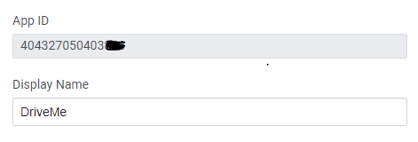
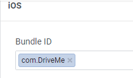
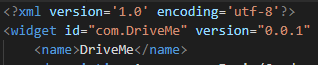
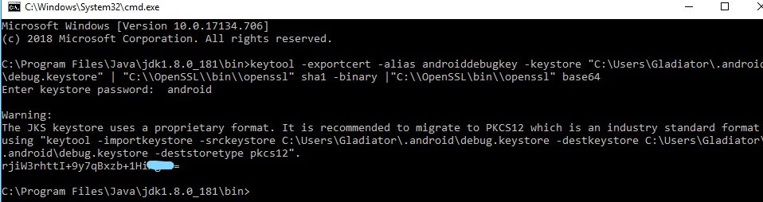
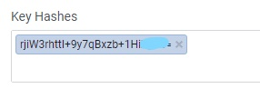
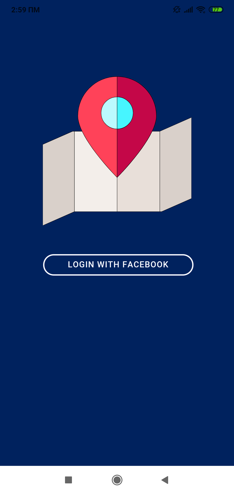
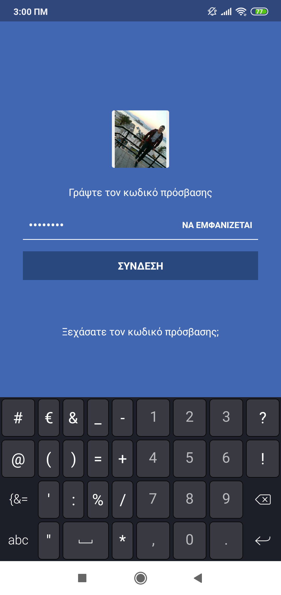
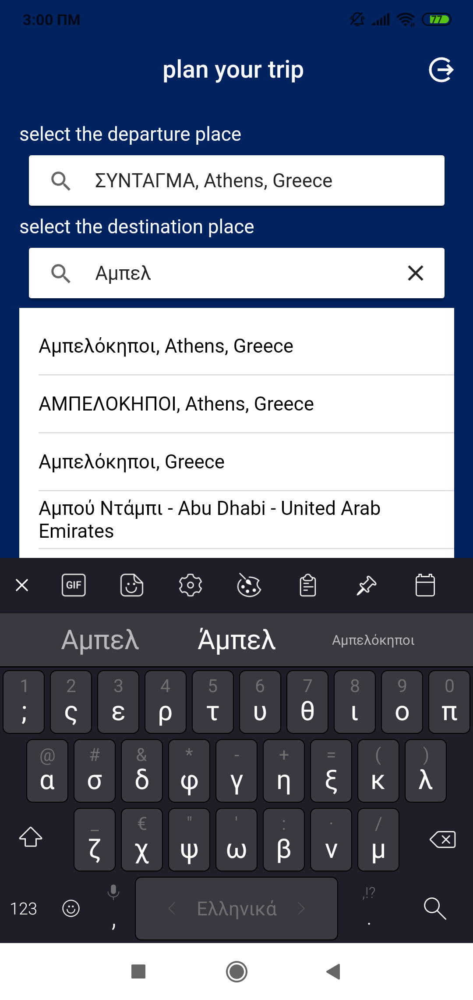
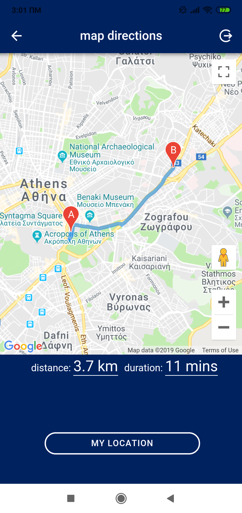
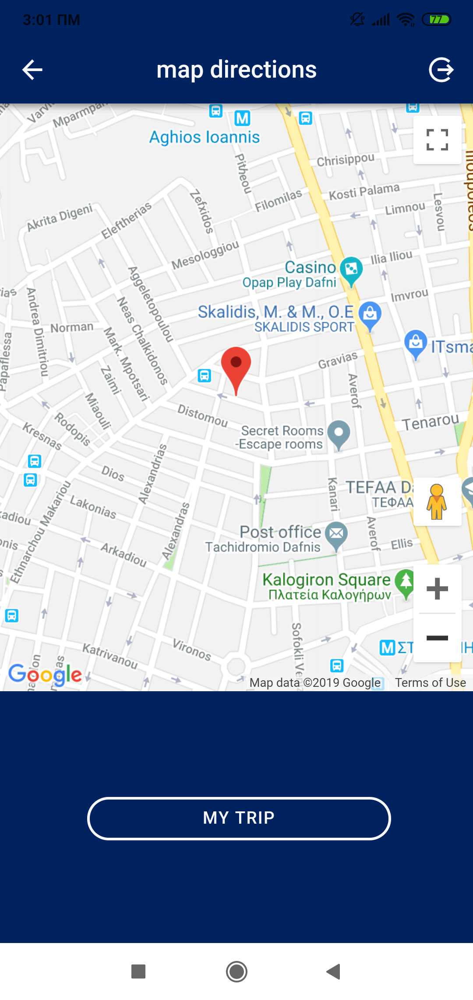

# DriveMe
# Introduction
In this repo i'm going to cover how to implement some of Google Maps functions inside an Ionic v4 app, using Places and Directions Google's Maps API.
## Basic operation of DriveMe
* The user should log in in the app using his/her Facebook credentials
* The user give two geolocation places int two autocomplete fields which will take the values from
google places.
* The app display their path on the map, the estimated time and the distance via google’s directions API.
* The app display the current position of the user.

Before we start developing the app, it's a good idea to think the app should be fully operational.For this reason,in the designing of the application,we have to think that the app must inform the user about the absense of network, for verifications about desicions like the logout or any failure of system.Ιn addition, as every modern application should have multilingual infrastructure.For the above functions we will use 
* AlertController, ToastController
* Network plugin (https://ionicframework.com/docs/native/network )
* i18n for multilingual ( https://github.com/ngx-translate/core )
* Native storage ( https://ionicframework.com/docs/native/native-storage )

## Login with Facebook credentials
We need the official plugin for Facebook in Apache Cordova that implements the latest Facebook SDK.( https://github.com/jeduan/cordova-plugin-facebook4 )
To use the FB plugin,we have to create a new Facebook App inside of the Facebook developer portal at https://developers.facebook.com/apps.


install plugin
```
ionic cordova plugin add cordova-plugin-facebook4 --variable APP_ID="404327050403***" --variable APP_NAME="DriveMe"
```
In the config.xml and set your app id and then set bundle id and google play package name of facebook app as below
  

Then we must generate hash keys 
 

Now we create a service in the app to implement the facebook login-logout,
``` ionic g service fb-login ```
we call fbLogIn function from the component like below
```
async Login(){
    if(this.connectivity.isOnline()){    //check for network

      await this.fbLogin.fbLogIn()
      .then((response)=>{
          if(response=="LoggedIn"){
            this.navCtrl.navigateForward('/home');
          }else{
            this.alerter.toastMessage(this.alerter.errors_msg.facebook_login_error);
          }  
      })
    }else{
      this.alerter.toastMessage(this.alerter.errors_msg.network_error);
    }
  }
  ```
  
```
async fbLogIn(){
       let promise= new Promise(async (resolve)=>{
        await this.fb.login(['email','public_profile']).then(async (response:FacebookLoginResponse)=>{
                  await this.fb.api('me?fields=id,name,email,first_name,last_name',[]).then(async (profile)=>{
                        this.userData={email:profile['email'],first_name:profile['first_name'],last_name:profile['last_name']};
                        this.isUserloggedIn=true;
                        await this.saveUser();
                        //  this.fb.logEvent(this.fb.EVENTS.EVENT_NAME_ADDED_TO_CART); 
                         console.log("apo service"); 
                          resolve("LoggedIn");
                  })  
          })
          .catch(e =>this.alerter.toastMessage(this.alerter.errors_msg.facebook_login_error));         
   
      })
    
      return promise;   
  }
  ```
  and the fbLogOut like below 
  ```
  async logout(){
    this.alerter.presentAlertConfirm(this.alerter.errors_msg.logout_question)
      .then(async(answer)=>{
            if(answer=="YES"){
              await this.fbLogin.fbLogOut().then((result)=>{
                  if(result=="LoggedOut"){
                    this.navCtrl.navigateBack('/login');
                  }
              })
            }
      })
  } 
  ```
  ```
  async fbLogOut(){
    let promise= new Promise(async (resolve)=>{
          await this.fb.logout().then(async(response)=>{
            console.log(response);
            await this.removeUser();
            // this.fb.logEvent(this.fb.EVENTS.EVENT_NAME_ADDED_TO_CART);
            this.isUserloggedIn=false;
            this.userData=null;
            resolve("LoggedOut");
          })
          .catch(e =>this.alerter.toastMessage(this.alerter.errors_msg.facebook_logout_error));
    })
    return promise;
  }
  ```
  
## Enable Google Maps Platform
First of all, we need to get an API key to be able to make requests to the Google Maps API. https://developers.google.com/
Then,we load the google script dynammicaly at the initialization of the app, in the app.component.ts .
```
//=========== use google api key ==============
      const script = document.createElement('script');
      script.id = 'googleMap';
      if (this.apiKey) {
          script.src = 'https://maps.googleapis.com/maps/api/js?key=' + this.apiKey+'&v=3.exp&libraries=places&language=en';
      } else {
          script.src = 'https://maps.googleapis.com/maps/api/js?key=&language=en';
      }
      document.head.appendChild(script);
```

## Autocomplete searchbars with google places
At the home.page.html we create two searchbar (one for departure point and one for the destination point).
```
 <ion-label class="searchLabels">{{this.home_page_words?.select_departure}}</ion-label>
   
        <ion-searchbar [(ngModel)]="this.location.departure.input" (ionInput)="this.location.updateSearchDepartureResults()"  
          (ionClear)="this.location.clearDepartureList()"  placeholder="Select departure place"></ion-searchbar>

        <ion-list [hidden]="this.location.autocompleteDeparture.length == 0">
            <ion-item  *ngFor="let item of this.location.autocompleteDeparture" tappable (click)="this.location.selectSearchDepartureResult(item)">
              {{ item.description }}
            </ion-item>
        </ion-list>
        
        <ion-label class="searchLabels">{{this.home_page_words?.select_destination}}</ion-label>
      <ion-searchbar [(ngModel)]="this.location.destination.input" (ionInput)="this.location.updateSearchDestinationResults()" 
            (ionClear)="this.location.clearDestinationList()" placeholder="Select destination place"></ion-searchbar>

      <ion-list  [hidden]="this.location.autocompleteDestination.length == 0">
          <ion-item  *ngFor="let item of this.location.autocompleteDestination" tappable (click)="this.location.selectSearchDestinationResult(item)">
            {{ item.description }}
          </ion-item>
      </ion-list>
      
  ```
I will describe the functionality for the departure searchbar.Τhe same functionality exists for the destination searhbar.
Everytime the searchbar input is updated we will trigger updateSearchDepartureResults() method witch is located at locationService.ts. In this method we will make a request to Google Autocomplete service and ask for Places predictions based on the input typed.
```
updateSearchDepartureResults(){
    if (this.departure.input == '') { 
      this.autocompleteDeparture = [];
      return;
    }    
    this.GoogleAutocomplete.getPlacePredictions({ input: this.departure.input },
    (predictions) => {
      this.autocompleteDeparture = [];
      this.zone.run(() => {
        try{
            predictions.forEach((prediction) => {
              this.autocompleteDeparture.push(prediction);
            });
        }catch{this.alerter.toastMessage(this.alerter.errors_msg.update_predictions_error)}
      });
    });
  }
  ```
  when the user select one of the google prediction selectSearchDepartureResult() method is called.We get the description of place and the clear the array with google's predictions.
  ```
  selectSearchDepartureResult(item){
    console.log(item);
      this.departure.input=item.description;
      this.autocompleteDeparture = [];
  }
  ```
## Google maps with polyline, distance and duration
First of all,to use google maps services we need to install some plugins.
```
npm install @ionic-native/core@beta @ionic-native/google-maps@beta
ionic cordova plugin add https://github.com/mapsplugin/cordova-plugin-googlemaps#multiple_maps
npm install @types/google-maps --save
```
Then in our application,when the user select the departure and the destination point and press the "start trip" button, we are navigating to the next page.At the map-direction page lets set up the map.
```
<div #Map class="map"></div>

    <ion-row *ngIf="this.viewport!='myLocation'">
      <ion-col size-xs="6" size-sm="6" size-md="6" size-lg="5" size-xl="3">
        <ion-label class="distanceLabel" *ngIf="this.distance">
                  {{this.map_direction_page_words?.distance}}<span>{{this.distance}}</span>
        </ion-label>
      </ion-col>
      <ion-col size-xs="6" size-sm="6" size-md="6" size-lg="5" size-xl="3">
        <ion-label  class="durationLabel" *ngIf="this.duration">
                  {{this.map_direction_page_words?.duration}}<span>{{this.duration}}</span>
        </ion-label>
      </ion-col>
    </ion-row>
```
we need a div for the map, and two labels for the distance and the duration of the user's trip.Don't forget to give some width at the map, to make sure the it will appear at the viewport.
```.map {
    width: 100%;
    height:70%;
}
```
In this time getTheDirections() function is called.We configure the directionsService by calling the route method and supplying it with an object that details the departure and destination, as well as the mode of travel.If the response of google is the expected response, then we call the getDistanceMatrix to get the distance and the duration.
```
async getTheDirections(departure:any,destination:any){
    if(this.connectivity.isOnline()){    //check for network

      const loadingC = await this.loadingController.create({
        spinner:'crescent',
        message: 'Please wait...',
        translucent: true
        // cssClass: ''
      });
      await loadingC.present();
      this.viewport="polyline";
  
        /*Map options*/
      this.mapOptions = {
        // center: this.googleMaps.myLocation,
        zoom: 18,
        mapTypeControl: false
    };
    await setTimeout(async () => {
        this.map = new google.maps.Map(this.mapElement.nativeElement, this.mapOptions);
  
          let directionsService = new google.maps.DirectionsService;
          let directionsDisplay = new google.maps.DirectionsRenderer;
          let matrix = new google.maps.DistanceMatrixService();
  
          directionsDisplay.setMap(this.map);
     
          await directionsService.route({
              origin: departure,
              destination: destination,
              travelMode: google.maps.TravelMode['DRIVING']
          }, (res, status) => {      
                                            // if directions found then call for distance matrix
              if(status == google.maps.DirectionsStatus.OK){
                  directionsDisplay.setDirections(res);    
                  matrix.getDistanceMatrix(
                    {
                      origins: [departure],
                      destinations: [destination],
                      travelMode: 'DRIVING',     
                    },  (res, status) => {
          
                      if (status == google.maps.DistanceMatrixStatus.OK) {
                        this.distance=res.rows[0].elements[0].distance.text;
                        this.duration=res.rows[0].elements[0].duration.text;
                        console.log(res);
                      }else{
                        console.log(status);
                      }
                  });
              } else {
                this.getMyLocation();
                this.alerter.toastMessage(this.alerter.errors_msg.direction_not_found);
                console.log(status);
              }
          });
          await loadingC.dismiss();
    }, 3000);
    
    }else{
      this.alerter.toastMessage(this.alerter.errors_msg.network_error);
    }
  }
```

## Get current position
To get the user's location we need to install geolocation plugin
```
ionic cordova plugin add cordova-plugin-geolocation
npm install --save @ionic-native/geolocation@4
```
In the same page with trip directions, with have a button which it calls getMyLocation() function.This function get the user's current position and displaying it at the map.
```
async getMyLocation(){
    if(this.connectivity.isOnline()){    //check for network
    
      const loadingC = await this.loadingController.create({
        spinner:'crescent',
        message: 'Please wait...',
        translucent: true
        // cssClass: ''
      });
      await loadingC.present();
      this.viewport="myLocation";
  
      await this.location.getCurrentPosition();
      /*Map options*/
      this.mapOptions = {
          center: this.location.myLocation,
          zoom: 17,
          mapTypeControl: false
      };
      await setTimeout(async () => {
          this.map = new google.maps.Map(this.mapElement.nativeElement, this.mapOptions);
          /*Marker Options*/
          this.markerOptions.position = this.location.myLocation;
          this.markerOptions.map = this.map;
          this.markerOptions.title = 'My Location';
          this.marker = new google.maps.Marker(this.markerOptions);
          await loadingC.dismiss();
      }, 3000);
    }else{
      this.alerter.toastMessage(this.alerter.errors_msg.network_error);
    }
 ```
 ```
   getCurrentPosition(){
    let options = {
      enableHighAccuracy: true,
      timeout: 25000
    };
     /*Get Current location*/
    this.geolocation.getCurrentPosition(options).then((position) =>  {
        this.myLocation.lat = position.coords.latitude;
        this.myLocation.lng = position.coords.longitude;
    }).catch((error) => {
      this.alerter.toastMessage(this.alerter.errors_msg.current_position_error)
    });

  }
```
##Screenshots
 
 
 
 
 


